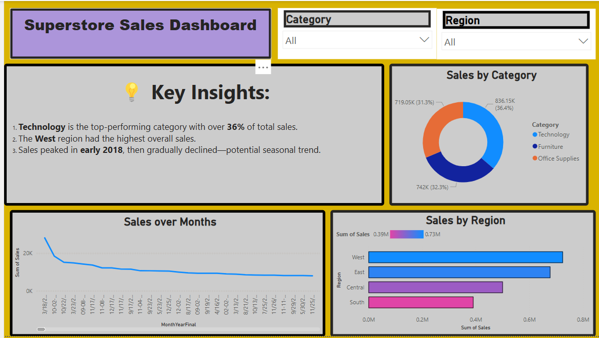

# Task-8-sales-dashboard
**Superstore Sales Analysis Dashboard using Power BI**

# 📊 Task 8: Superstore Sales Dashboard using Power BI

## 📝 Task Summary

In this task, I designed an interactive and visually appealing sales dashboard using **Power BI** to analyze performance by **product category**, **region**, and **monthly trends**.  
The data was extracted from the `Superstore_Sales.csv` file, and multiple chart types were used to summarize sales insights for business decision-making.

---

## 📁 Dataset Used

**`Superstore_Sales.csv`**  
🧾 Columns: `Order Date`, `Region`, `Category`, `Sales`, `Profit`

---

## 🔧 Tools & Process

- 🛠 **Tool Used**: Power BI
- 🧹 **Data Cleaning**: Basic formatting of `Order Date`
- 📆 Converted `Order Date` to **Month-Year** format
- 📊 Created 3 Visualizations:
  - **Line Chart**: Monthly Sales Trend 📈
  - **Bar Chart**: Sales by Region 🗺️
  - **Donut Chart**: Sales by Category 🍩
- 🎛️ Added **Region slicer** for interactivity
- 🎨 Used colors to highlight high-performing segments

---

## 📷 Executed Dashboard (Screenshot)

---

## 💡 Key Insights from the Dashboard

🔹 **Insight 1:**  
💻 **Technology** is the leading product category, contributing **36%** of total sales. It indicates strong interest in tech-related purchases.

🔹 **Insight 2:**  
🌍 The **West Region** dominates in total sales, reflecting better performance and possible market maturity in that area.

🔹 **Insight 3:**  
🎄 A significant **sales peak occurred in December**, revealing a clear **seasonal trend**—likely tied to year-end shopping.

🔹 **Insight 4:**  
📉 The **South Region** consistently reports the **lowest sales**, suggesting the need for targeted campaigns or product re-alignment.

💡 **Business Tip:**  
Focus marketing strategies on underperforming regions (like South), and prepare inventory in advance for December spikes.

---

## 📽️ Dashboard Summary Presentation

🎯 [Task 8 - Sales Dashboard PPT](Task8_Superstore_Sales_Dashboard_Presentation.pptx)

---

## ❓ Interview Questions & Answers

**1. What does a dashboard do?**  
➡️ A dashboard visually displays key metrics and trends to help users understand business performance at a glance.

**2. How do you choose the right chart?**  
➡️ The choice depends on the story you're telling:
- Line charts = Trends over time  
- Bar charts = Comparison across categories  
- Donut charts = Share of total (percentages)

**3. What is a slicer/filter?**  
➡️ A slicer allows users to interactively filter the data by categories like Region or Product Type.

**4. Why do we use KPIs?**  
➡️ KPIs (Key Performance Indicators) track business goals and provide quick insights into whether targets are being met.

**5. What did your dashboard show about sales?**  
➡️ Technology leads all categories, West is the best-performing region, and sales spike during December.

**6. How do you make a dashboard look clean?**  
➡️ Use consistent colors, align visuals properly, avoid clutter, and apply spacing to ensure visual clarity.

**7. Did you clean the data before starting?**  
➡️ Yes, basic formatting was done—particularly converting `Order Date` into Month-Year format.

---

## 👨‍💻 Author 

[Mihir Sonar](https://www.linkedin.com/in/mihir-sonar-2287041bb)  

---
